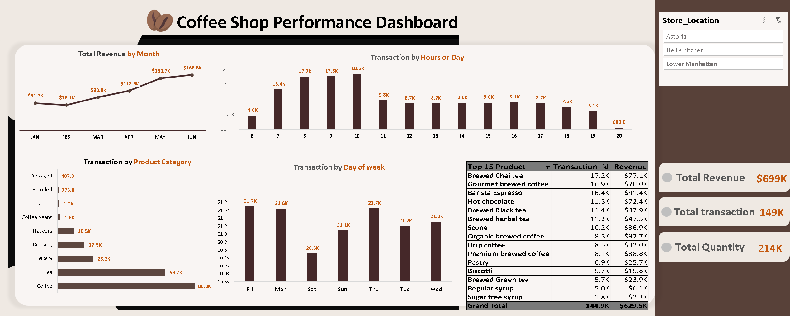

# Coffee Shop Sales Dashboard | Excel

One of my projects focuses on building an **interactive Coffee Shop Sales Dashboard** using Microsoft Excel, designed to analyze sales performance and support data-driven decision making.

## 🔍 Dashboard Insights
- **Revenue Analysis:** By month, product category, and top-performing products
- **Peak Days & Hours:** Insights for operational optimization
- **Top 15 Products:** Driving the highest number of transactions

## 🛠 Tools & Skills
Excel | Pivot Tables | Slicers | Dynamic Formulas | Charts & Dashboard Design | Data Storytelling

## Dashboard Preview

## 🙏 Acknowledgment
Special thanks to **Dina Ezzat, M.Sc.**  
and the **Digital Egypt Pioneers Initiative (DEPI)**  
for their guidance and support throughout this project.

